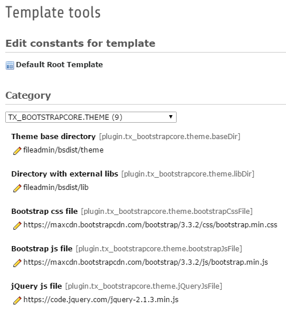
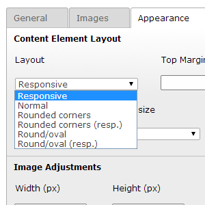
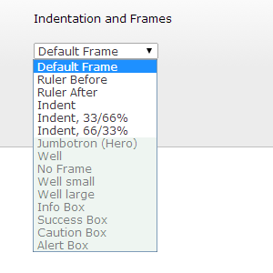
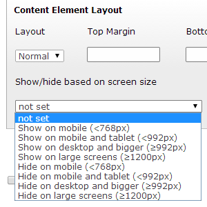

.. ==================================================
.. FOR YOUR INFORMATION
.. --------------------------------------------------
.. -*- coding: utf-8 -*- with BOM.

.. include:: ../../Includes.txt

Features provided by extension bootstrap_core
=============================================
The extension bootstrap_core adds bootstrap-related features to content elements and modifies the rendering of specific content types (text/images, menu, mailform...).

Constants
---------
A few constants are used to define the paths and urls to assets and for main website settings.

- paths to the directories with the libraries and the website theme files

- urls (or paths if changed to local files) to bootstrap, jquery and other resources

- default language settings

The default configuration of ext:bsdist overwrites some of these settings, e.g. to load assets locally.

All constants defined by bootstrap_core. The paths for the *baseDir* and the *libDir* match the directory structure of the bsdist distribution assets.

.. code-block:: typoscript

	plugin.tx_bootstrapcore {
		theme {
			baseDir = fileadmin/bsdist/theme
			libDir = fileadmin/bsdist/lib
			bootstrapCssFile = https://maxcdn.bootstrapcdn.com/bootstrap/3.3.5/css/bootstrap.min.css
			bootstrapJsFile = https://maxcdn.bootstrapcdn.com/bootstrap/3.3.5/js/bootstrap.min.js
			jQueryJsFile = https://code.jquery.com/jquery-2.1.4.min.js
			lightboxCssFile = https://raw.githubusercontent.com/scaron/prettyphoto/master/css/prettyPhoto.css
			lightboxJsFile = https://raw.githubusercontent.com/scaron/prettyphoto/master/js/jquery.prettyPhoto.js
			contentCssFile = typo3conf/ext/bootstrap_core/Resources/Public/Css/content.css
			iconDir = typo3conf/ext/bootstrap_core/Resources/Public/Icons/fileicons/
		}
		website {
			lang {
				locale = en_EN.UTF-8
				localeShort = en
			}
		}
	}

Config object
-------------
Config object properties set by the extension bootstrap_core.

.. code-block:: typoscript

	config {
		doctype = html5
		disablePrefixComment = 1
		removeDefaultJS = external
		inlineStyle2TempFile = 1
		absRefPrefix = /
		prefixLocalAnchors = all
		extTarget =
		noScaleUp = 1
		spamProtectEmailAddresses = ascii
		sys_language_uid = 0
		language = {$plugin.tx_bootstrapcore.website.lang.localeShort}
		locale_all = {$plugin.tx_bootstrapcore.website.lang.locale}
		htmlTag_langKey < config.language
		tx_realurl_enable = 1
		admPanel = 0
	}

Basic page setup
----------------
A basic page setup based on FLUIDTEMPLATE, ready for additional page templates, is defined in the bootstrap_core extension.
The paths to the html templates match the directory structure of the bsdist extension file package which was copied to fileadmin/bsdist during the installation.

.. code-block:: typoscript

	page = PAGE
	page {
		typeNum = 0
		10 = FLUIDTEMPLATE
		10 {
			layoutRootPath = {$plugin.tx_bootstrapcore.theme.baseDir}/tmpl/backend_layout/Layouts/
			partialRootPath = {$plugin.tx_bootstrapcore.theme.baseDir}/tmpl/backend_layout/Partials/
			file.cObject = CASE
			file.cObject {
				key.data = levelfield:-1, backend_layout_next_level, slide
				key.override.field = backend_layout
				default = TEXT
				default.value = {$plugin.tx_bootstrapcore.theme.baseDir}/tmpl/backend_layout/tmpl_default.html
			}
			variables {
				content < styles.content.get
			}
		}
	}

jQuery and bootstrap
--------------------
The main assets for bootstrap, jQuery and the lightbox library prettyPhoto are set. The paths or urls are defined as constants (see above).

.. code-block:: typoscript

	page {
		#...

		includeCSS {
			bootstrap = {$plugin.tx_bootstrapcore.theme.bootstrapCssFile}
			bootstrap_core = {$plugin.tx_bootstrapcore.theme.contentCssFile}
			lightbox = {$plugin.tx_bootstrapcore.theme.lightboxCssFile}
		}
		includeJSlibs{
			jquery = {$plugin.tx_bootstrapcore.theme.jQueryJsFile}
		}
		includeJSFooterlibs {
			bootstrap = {$plugin.tx_bootstrapcore.theme.bootstrapJsFile}
			lightbox = {$plugin.tx_bootstrapcore.theme.lightboxJsFile}
		}
	}

Image features and rendering
----------------------------
The layout field of image and text/image content elements is modified to show default bootstrap image layout options.

The corresponding typoscript snippet which changes the rendering is as follows. Reduce, change, extend it for your project.

.. code-block:: typoscript

	tt_content.image {
		20 {
			1 {
				params.cObject = CASE
				params.cObject {
					key.field = layout
					default = TEXT
					default.value = class="img-responsive img-content"
					1 = TEXT
					1.value = class="img-content"
					2 = TEXT
					2.value = class="img-rounded img-content"
					3 = TEXT
					3.value = class="img-rounded img-responsive img-content"
					4 = TEXT
					4.value = class="img-circle img-content"
					5 = TEXT
					5.value = class="img-circle img-responsive img-content"
				}
			}
		}
	}

In addition the layout markup, rendering settings and handling of image columns is changed by bootstrap_core. See setup.txt in the extension for more information.

Section frames (wrapper)
------------------------
The section frame options are extended with bootstrap-specific default container layouts.
The rendering of some of the predefined TYPO3 section frames is modified.

Visibility field
----------------
An additional field is added to content elements which allows to define the visibility of the content element based on default bootstrap breakpoints.
Based on the selection additional classes are added to the outer div element to hide/show the element on certain device sizes.

Table options and rendering
---------------------------
The flexform for the table content element is replaced to support a few predefined bootstrap supported table layout options.
The rendering of tables is modified to wrap the table with 

.

Mailform rendering
------------------
The rendering of mailforms is modified to create markup supported by bootstrap.

Menu options and rendering
--------------------------
The menu layout options are changed to provide bootstrap-style navigation layouts (nav pills and co.).
