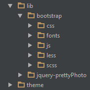
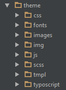
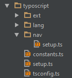
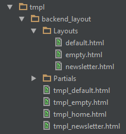
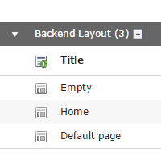

.. ==================================================
.. FOR YOUR INFORMATION
.. --------------------------------------------------
.. -*- coding: utf-8 -*- with BOM.

.. include:: ../../Includes.txt

For website development
=======================

The assets installed with the bsdist distribution were copied to /fileadmin/bsdist/.

The lib directory
-----------------

In the lib directory external libraries and packages are stored. See chapter npm, bower and grunt.
The path to the lib directory is set in the constant plugin.tx_bootstrapcore.theme.libDir.

The theme directory
-------------------

The theme directory holds all website-specific files - templates, resources, scripts and typoscript code.
The path to the theme directory is set in the constant plugin.tx_bootstrapcore.theme.baseDir.

Page setup, templates and backend layouts
-----------------------------------------

The files *constants.ts*, *setup.ts* and *tsconfig.ts* are the starting point to modify the default TYPO3 website setup defined by bootstrap_core and bsdist.
The extension bootstrap_core has already set some config properties and defined a basic page object.
The bsdist package redefines (for readability) and changes some of these objects and properties.

In the file *theme/typoscript/setup.ts* the main page object is redefined. The template file part is extended to provide a third template with a sidebar column and an empty template.

.. code-block:: typoscript

	page = PAGE
	page {
		typeNum = 0
		10 = FLUIDTEMPLATE
		10 {
			layoutRootPath = {$plugin.tx_bootstrapcore.theme.baseDir}/tmpl/backend_layout/Layouts/
			partialRootPath = {$plugin.tx_bootstrapcore.theme.baseDir}/tmpl/backend_layout/Partials/

			file.cObject = CASE
			file.cObject {
				key.data = levelfield:-1, backend_layout_next_level, slide
				key.override.field = backend_layout
				default = TEXT
				default.value = {$plugin.tx_bootstrapcore.theme.baseDir}/tmpl/backend_layout/tmpl_default.html
				2 = TEXT
				2.value       = {$plugin.tx_bootstrapcore.theme.baseDir}/tmpl/backend_layout/tmpl_home.html
				3 = TEXT
				3.value       = {$plugin.tx_bootstrapcore.theme.baseDir}/tmpl/backend_layout/tmpl_empty.html
			}

			variables {
				content < styles.content.get
				content_sidebar < styles.content.get
				content_sidebar.select.where = colPos=1
			}
		}
	}

Templates
^^^^^^^^^
The templates **tmpl_default.html** and **tmpl_home.html** as well as the layout template **default.html** are the main
starting point to change the html markup of the website.

Backend layouts
^^^^^^^^^^^^^^^
The number 2 and 3 which are used in the page setup above for the home and the empty template are the UIDs of the corresponding backend layout objects.
(Default page: UID 1, Home: UID 2, Empty: UID 3)

Adding another page template
^^^^^^^^^^^^^^^^^^^^^^^^^^^^
To add another page template

- create a new html template (e.g. with 3 content columns, tmpl_3cols.html)
- create a new backend layout record for the template
- add typoscript code to *setup.ts* to link the UID of the new backend layout record (e.g. UID 4) to the new html template

.. code-block:: typoscript

	file.cObject {
		4 = TEXT
		4.value       = {$plugin.tx_bootstrapcore.theme.baseDir}/tmpl/backend_layout/tmpl_3cols.html
	}

- if you created a template with a 3rd content slot, assign the content from the new slot (e.g. colPos=2) to a new variable. Use this variable in your html template.

.. code-block:: typoscript

	variables {
		content_leftcol < styles.content.get
		content_leftcol.select.where = colPos=2
	}

