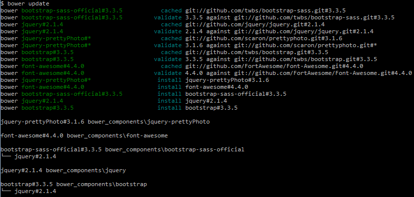
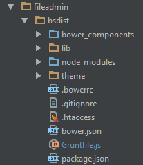
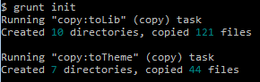
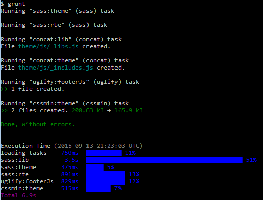
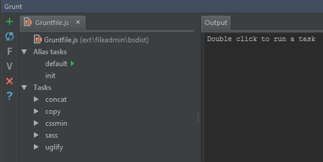

.. ==================================================
.. FOR YOUR INFORMATION
.. --------------------------------------------------
.. -*- coding: utf-8 -*- with BOM.

.. include:: ../../Includes.txt
.. _node: https://nodejs.org/en/download/
.. _bower: http://bower.io/#install-bower
.. _grunt: http://gruntjs.com/getting-started

npm, bower and grunt
====================

Install `node`_, `bower`_ and `grunt`_ to use the build features.

Initialisation
--------------
Open a command line tool and change to the directory *fileadmin/bsdist/* of your new TYPO3 instance.

1. Install the node packages.

.. code:: bash

    npm update

2. Use bower to install the main components.

.. code:: bash

    bower update

*Font Awesome will not be installed in the default configuration! See file bower.json.*

After sucessfully installing the node packages and bower components there are two new folders in fileadmin/bsdist.

3. The grunt task *init* copies files from *bower_components/* to *lib/* and executes all tasks (full).

.. code:: bash

    grunt init

Update merged and minified CSS and Javascript
---------------------------------------------

When CSS and JavaScript files were added or modified you may use the *default* grunt task to merge and minify the resources.

.. code:: bash

    grunt

Or use tools in your IDE...

The files in *lib/* - i.e. bootstrap scss - are not processed with the *default* task.
Only the task group named *full* sassifies and concats the resources in lib/.

.. code:: bash

    grunt full
