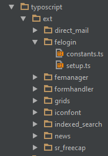

.. ==================================================
.. FOR YOUR INFORMATION
.. --------------------------------------------------
.. -*- coding: utf-8 -*- with BOM.

.. include:: ../../Includes.txt

Included extension setups
=========================

The package includes basic configurations for a few additional extensions. These configurations and templates are provided "as-is"!
Important: See the manuals of the extensions for information about how to install and configure them before testing and using the setups provided by bsdist.

Before including an extension setup, try to understand the provided configuration (changes) and/or templates. What was changed compared to the original setups?
Include the configuration files of additional extension in the root files using INCLUDE_TYPOSCRIPT. See *constant.ts* and *setup.ts*.

Example from *setup.ts*, at the end of the file.

.. code-block:: typoscript

	/* --------------------
	* Additional configurations
	*/
	<INCLUDE_TYPOSCRIPT: source="FILE:fileadmin/bsdist/theme/typoscript/nav/setup.ts">
	#<INCLUDE_TYPOSCRIPT: source="FILE:fileadmin/bsdist/theme/typoscript/lang/multilang.ts">
	#<INCLUDE_TYPOSCRIPT: source="FILE:fileadmin/bsdist/theme/typoscript/lang/langnav.ts">

	# --- Extension setups (see constants.ts) ---
	#
	#<INCLUDE_TYPOSCRIPT: source="FILE:fileadmin/bsdist/theme/typoscript/ext/indexed_search/setup.ts">
	#<INCLUDE_TYPOSCRIPT: source="FILE:fileadmin/bsdist/theme/typoscript/ext/felogin/setup.ts">
	#<INCLUDE_TYPOSCRIPT: source="FILE:fileadmin/bsdist/theme/typoscript/ext/grids/setup.ts">
	#<INCLUDE_TYPOSCRIPT: source="FILE:fileadmin/bsdist/theme/typoscript/ext/iconfont/setup.ts">
	#<INCLUDE_TYPOSCRIPT: source="FILE:fileadmin/bsdist/theme/typoscript/ext/formhandler/setup.ts">
	#<INCLUDE_TYPOSCRIPT: source="FILE:fileadmin/bsdist/theme/typoscript/ext/sr_freecap/setup.ts">

