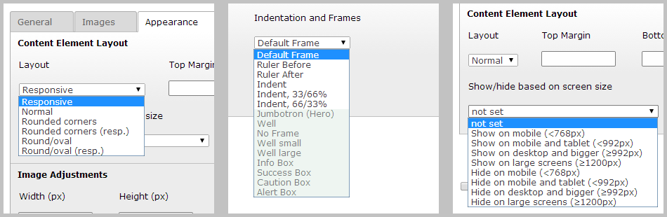
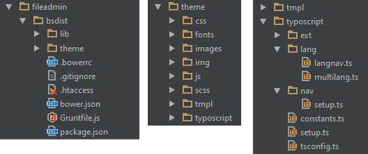
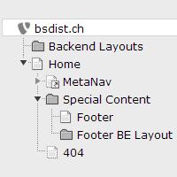
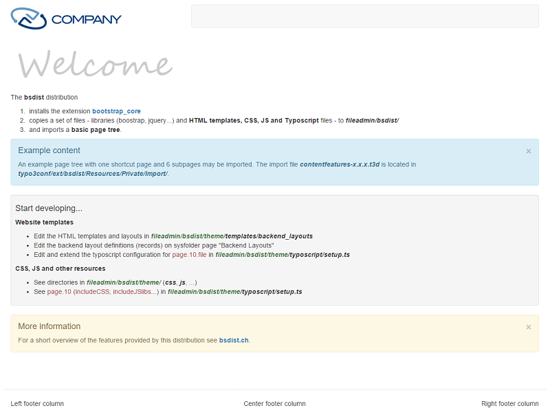

.. ==================================================
.. FOR YOUR INFORMATION
.. --------------------------------------------------
.. -*- coding: utf-8 -*- with BOM.

.. include:: ../../Includes.txt
.. _bootstrap_core: http://typo3.org/extensions/repository/view/bootstrap_core

============
Introduction
============

What does it do?
================

During the installation of the bsdist distribution

- the extension `bootstrap_core`_ will be installed

- a set of files are copied to *fileadmin/bsdist/*

- and a basic resource and page tree is imported.

Screenshots
===========
Backend features provided by extension `bootstrap_core`_.

A package of files to start developing a new website.

A basic page tree is imported.

The homepage of the website after installation.

